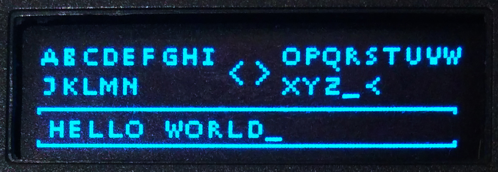
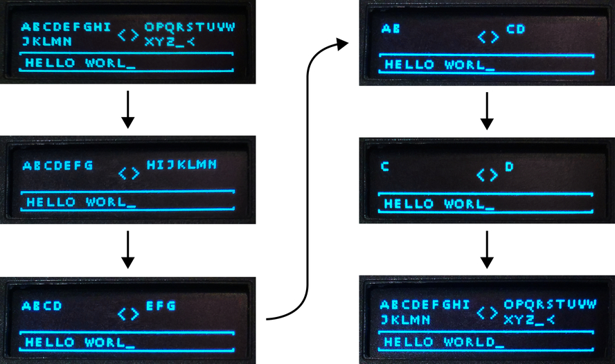

# Ledger Nano S Binary Keyboard Demo

This repository contains an application designed to demonstrate a "binary
keyboard" I am developing for the [Ledger Nano
S](https://github.com/LedgerHQ/ledger-nano-s).

This application also uses
[BUI](https://github.com/parkerhoyes/bolos-user-interface), the graphics library
I created as an alternative to the standard BAGL that's a part of the official
SDK for the Nano S.

## Design Explanation & Description

With this keyboard design, the letters available for the user to type are shown
on the top part of the screen, separated in half. In the bottom third of the
screen is a textbox that displays the text that has been entered by the user,
followed by a cursor (an underscore).

This keyboard design is called "binary" because it works by repeatedly
subdividing the available characters in half. The user is repeatedly shown a set
of characters with half on each side of the screen. The user then presses the
left or right button on the Nano S to select the side that the letter they would
like to type is on. The keyboard then splits the characters on that side of the
screen in half again and repeats until the user selects a single character. In
fact, the most number of button presses required to select a single character
from a set of 32 with this design is log2(32), which is 5. This makes this
keyboard design one of the most efficient options on a device with only two
buttons.

The current design also includes a backspace character which is currently
represented by a less than sign (`<`). Choosing this character will remove the
most recently typed one. In theory, the design could be modified to add all
sorts of options to the keyboard, not just letters to type. In addition, a user
using this keyboard to type could signal to the app that they are done typing by
pressing both buttons at the same time (in this demo, that just exits the app).

## Development Cycle

This repository will follow a Git branching model similar to that described in
[Vincent Driessen's *A successful Git branching
model*](http://nvie.com/posts/a-successful-git-branching-model/) and a
versioning scheme similar to that defined by [Semantic Versioning
2.0.0](http://semver.org/).

## License

This library is distributed under the terms of the very permissive [Zlib
License](https://opensource.org/licenses/Zlib). The exact text of this license
is reproduced in the `LICENSE.txt` file as well as at the top of every source
file in this repository.
